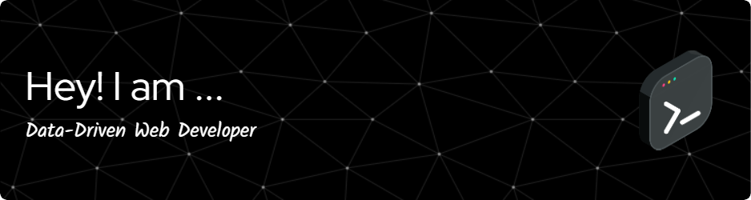

    

<h1 align="center">👾 Hello, World! I'm Shubham Sharma 👾</h1>
<h3 align="center">🚀 Aspiring Developer | Code Ninja | Tech Enthusiast 🤖</h3>

    

    
    

 

<h3 align="center">🌌 Connect with Me 🌌</h3>

    
    

 

    🚀 I'm on a mission to conquer the tech cosmos and redefine reality!
     
    🤖 My code is powered by coffee, dreams, and an unwavering passion for innovation.
     
    💡 Let's turn ideas into lines of code and transform the ordinary into the extraordinary.
     
    🌌 Join me as we embark on a journey to push the boundaries of what's possible.

 

<h3 align="center">Languages and Tools 🛠️</h3>

    
    
    <!-- Add more icons here -->

 

    

    

    

---

    <em>Made with ❤️ by <a href="https://github.com/shubham270301">Shubham Sharma</a></em>

